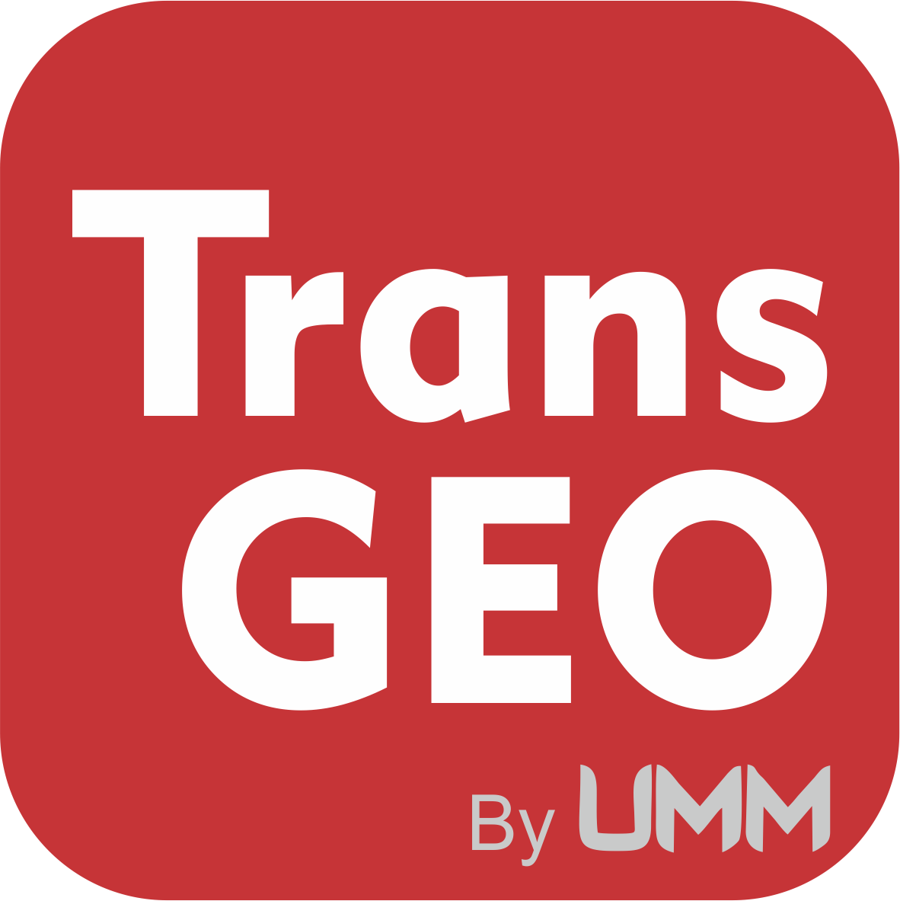

    

# TransGeo App
TransGeo is learning media android platform to analyze the mathematical ability of students with relational thinking skills in geometry transformation material. This repo is based on our research in the competition of PKM 2021.

# Android
This app made by me using Kotlin Framework. 

# Material
TransGeo covers the Geometric Transformation material:
- Translation
- Rotation
- Reflection
- Dilatation

# Awards
> Program Kreativitas Mahasiswa (PKM) is a prestigious event for all Universities in Indonesia

Pekan Ilmiah Mahasiswa Nasional (PIMNAS) or National Student Science Week, is an annual official event of the National Achievement Center, Ministry of Education, Culture, Research, and Technology (Kemendikbudristek) in the field of reasoning to compete for national-level student scientific work. We beat thousands of other PKM participants and successfully qualified for the PIMNAS Competition.
### &ensp; 1. PKM 2021 Funding Winner 🏆
### &ensp; 2. Participant in PIMNAS 2021 🏅
---
# Team Members
1. SAHRUL RAMADHAN
2. MALIKA KAUTSAR ILMI
3. SOFYAN KURNIANTO
4. RIZKY INDRABAYU
5. DEVI NURTRIA SANDY
